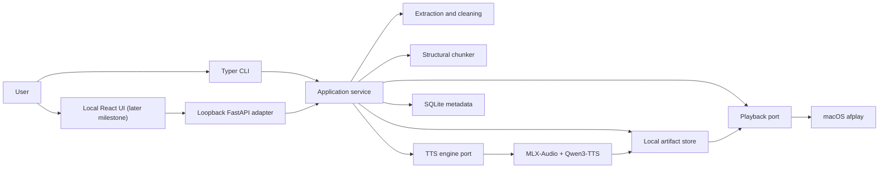
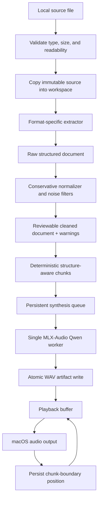

# Local Natural TTS Reader: Design and Architecture

Status: Draft 0.1  
Last updated: 2026-08-16  
Target platform: Apple-silicon macOS, initially the owner's Mac Studio

## 1. Vision

Local Natural TTS Reader turns a local document into natural, resumable speech without sending the document or generated audio to a cloud service. A user supplies a TXT, Markdown, PDF, or HTML file; reviews the extracted text when needed; chooses a Qwen3-TTS narrator; and begins listening while later chunks continue to render locally.

The first complete release must support this observable workflow:

1. Import a supported local file.
2. Extract and conservatively clean its readable prose.
3. Preview extraction warnings and the exact text that will be spoken.
4. Split the text at structural and sentence boundaries.
5. Generate audio locally with MLX-Audio and Qwen3-TTS.
6. Start playback after the first chunk is ready, generate ahead of playback, and persist progress.
7. Stop and resume later without regenerating valid cached audio.

"Local" means that the runtime binds only to the loopback interface, reads local files, stores all state on the Mac, and makes no network request after model weights and project dependencies have been downloaded. Model acquisition is a separate, explicit setup operation.

## 2. Goals and non-goals

### 2.1 Goals

- Produce natural long-form narration using MLX-Audio on Apple silicon, with Qwen3-TTS as the primary engine.
- Support `.txt`, `.md`, `.markdown`, `.pdf`, `.html`, and `.htm` inputs in the minimum viable product (MVP).
- Preserve fidelity: deterministic cleaning must not summarize, paraphrase, or invent document content.
- Make every transformation inspectable by retaining the source, extracted form, cleaned form, chunks, and generation metadata.
- Begin playback before the whole document is synthesized.
- Resume after interruption and reuse cached audio when the source, cleaned text, model, voice, and synthesis settings have not changed.
- Fail clearly on scanned PDFs, encrypted PDFs, unsupported encodings, missing models, insufficient disk space, and synthesis failures.
- Keep extraction, cleaning, chunking, TTS, playback, persistence, and user interfaces replaceable behind narrow Python interfaces.
- Provide a CLI first and a local browser interface after the core pipeline is proven.

### 2.2 Non-goals for the MVP

- Fetching arbitrary web URLs. HTML means a local HTML file in the MVP.
- OCR for image-only or scanned PDFs. Such files are detected and reported as requiring a future OCR adapter.
- Perfect reading order for every multi-column, mathematical, or heavily designed PDF.
- EPUB, DOCX, or image ingestion. The architecture permits new extractors, but these formats follow the MVP.
- Cloud synchronization, accounts, remote APIs, analytics, or telemetry.
- Summarization, translation, podcast conversion, or LLM-based rewriting.
- Voice cloning or voice design in the first user-facing workflow. The engine boundary supports these later, with explicit consent and provenance requirements.
- Mobile playback or a packaged native macOS application in the first release.
- Fine-grained seeking within a generated chunk. The MVP resumes at chunk boundaries.
- Commercial redistribution of model weights or generated voice assets. Model and voice licenses must be reviewed separately before distribution.

## 3. Assumptions and constraints

- The machine is an Apple-silicon Mac with sufficient unified memory for a quantized Qwen3-TTS 1.7B model.
- Python 3.12 and `uv` manage the project-local environment. Project packages are never installed globally.
- The primary model profile is a configurable MLX-community Qwen3-TTS 1.7B CustomVoice conversion. CustomVoice is selected because it exposes preset speakers and style instructions. The exact tested model identifier is pinned in project configuration after the feasibility spike; it is not scattered through application code.
- A faster Qwen3-TTS 0.6B profile can be added without changing the pipeline. The Qwen `Base` profile is reserved for later voice cloning, and `VoiceDesign` is reserved for later designed voices.
- The built-in macOS `afplay` executable is the first playback backend, avoiding a system-level audio dependency. Playback is replaceable with a streaming Core Audio or native Swift backend later.
- Chunk WAV files are the canonical generated artifacts. Lossy exports such as M4A/M4B are optional derivatives and require a locally available `ffmpeg` executable.
- SQLite stores metadata and state. Audio and intermediate text artifacts remain ordinary files because large binary objects do not belong in the database.
- Only one Qwen synthesis worker runs by default. This bounds unified-memory use and makes ordering, cancellation, and thermal behavior predictable. Playback and synthesis may run concurrently.

## 4. Architecture principles

1. **Local and inspectable by default.** No input leaves the machine, and the user can inspect the exact cleaned text and every chunk.
2. **Conservative transformation.** Deterministic cleanup removes presentation noise, not meaning. Ambiguous removal is surfaced as a warning or left intact.
3. **Immutable inputs, reproducible outputs.** The source is copied into an application workspace and never modified. Derived artifacts are keyed by their inputs and configuration.
4. **Resumability over throughput.** Each chunk is independently persisted so a crash loses at most the in-flight chunk.
5. **Ports and adapters.** Core logic depends on small interfaces (ports); format readers, MLX-Audio, SQLite, `afplay`, and the web UI are adapters that implement those interfaces.
6. **A useful vertical slice first.** TXT-to-Qwen-to-speakers is proven before expanding extraction and UI scope.
7. **Measure before tuning.** Chunk size, quantization, generation-ahead depth, and model profile are benchmarked on the target Mac instead of assumed.

## 5. System context



The application service is the single orchestration layer. The CLI and future HTTP API invoke the same use cases rather than implementing their own extraction or synthesis logic.

## 6. End-to-end data flow



Import, extraction, cleaning, and chunking are deterministic for a given pipeline version and configuration. Speech generation can be stochastic, so its seed and generation settings are persisted when the engine exposes them.

## 7. Repository structure

The implementation should converge on this structure:

```text
local-natural-tts-reader/
|-- docs/
|   |-- design-and-architecture.md
|   |-- local-natural-TTS-reader-brainstorming.md
|   `-- plan.md
|-- samples/
|   |-- html/
|   |-- markdown/
|   |-- pdf/
|   `-- text/
|-- scripts/
|   `-- verify_offline_runtime.sh
|-- src/local_tts_reader/
|   |-- application/
|   |   |-- pipeline.py
|   |   |-- playback_service.py
|   |   `-- synthesis_service.py
|   |-- chunking/
|   |   |-- chunker.py
|   |   `-- sentences.py
|   |-- cleaning/
|   |   |-- common.py
|   |   `-- pdf.py
|   |-- domain/
|   |   |-- models.py
|   |   `-- states.py
|   |-- ingestion/
|   |   |-- base.py
|   |   |-- html.py
|   |   |-- markdown.py
|   |   |-- pdf.py
|   |   |-- registry.py
|   |   `-- text.py
|   |-- playback/
|   |   |-- afplay.py
|   |   `-- base.py
|   |-- storage/
|   |   |-- artifacts.py
|   |   |-- database.py
|   |   `-- repositories.py
|   |-- tts/
|   |   |-- base.py
|   |   |-- fake.py
|   |   `-- mlx_qwen.py
|   |-- cli.py
|   `-- config.py
|-- tests/
|   |-- fixtures/
|   |-- integration/
|   `-- unit/
|-- web/                         # Added after the CLI vertical slice
|-- pyproject.toml
`-- README.md
```

The package name is `local_tts_reader`; the console command is `reader`.

## 8. Domain model

### 8.1 Structured document

Every extractor returns the same internal representation:

- `Document`: identity, source metadata, optional title and author, extraction warnings, and ordered sections.
- `Section`: optional heading, hierarchy level, ordered blocks, and source span.
- `Block`: a typed unit such as paragraph, list item, block quote, heading, or explicit pause.
- `SourceSpan`: format-specific provenance such as PDF page numbers, HTML element position, Markdown line range, or TXT character offsets.

Provenance makes a suspicious spoken passage traceable back to the source. Extractors must not return an unstructured string when the source provides useful boundaries.

### 8.2 Chunk

A `Chunk` contains:

- stable `chunk_id`;
- document and ordinal identifiers;
- text to speak;
- section title and source spans;
- boundary kind (`section`, `paragraph`, `sentence`, or `forced`);
- pause-after duration;
- character and sentence counts;
- a content hash;
- zero or more warnings.

Chunk IDs are derived from the cleaned-document hash, chunking configuration version, ordinal, and text hash. They must not depend on timestamps.

### 8.3 Synthesis profile

A synthesis profile records engine, exact model ID or local model path, model revision when available, model mode, quantization, speaker, language, instruction, speed, sample rate, generation parameters, and application adapter version. This complete profile is hashed into the audio cache key.

The initial human-facing profile is equivalent to:

```yaml
engine: mlx_audio_qwen3
mode: custom_voice
model: mlx-community/Qwen3-TTS-12Hz-1.7B-CustomVoice-6bit
speaker: Aiden
language: English
instruction: Calm, clear long-form narration with restrained expression and natural pauses.
speed: 1.0
```

The feasibility milestone must validate and, if necessary, update this exact identifier and call path against the pinned MLX-Audio release. Configuration, tests, and documentation are then updated together.

### 8.4 Persistent states

An import moves through these states:

```text
imported -> extracted -> cleaned -> chunked -> ready
                                      |
                                      v
                         synthesizing -> playable -> complete
                               |             |
                               v             v
                             failed        paused
```

`failed` is not terminal. A retry increments an attempt counter and returns only the failed chunk to the queue. State transition functions reject illegal transitions.

## 9. Ingestion and extraction

### 9.1 Common import contract

The importer resolves the path, checks that it is a regular readable file, enforces configurable byte and page limits, identifies the format from both extension and content, computes SHA-256 while copying, and writes the source atomically into the document workspace. Symbolic links are resolved before policy checks. The original file is never changed.

The registry selects one extractor by detected media type. Unsupported or ambiguous types fail before workspace state is committed.

### 9.2 Plain text

The TXT extractor uses a byte-order mark when present and `charset-normalizer` otherwise. Low-confidence decoding produces a warning and requires an explicit encoding override. Paragraph breaks are preserved; runs of horizontal whitespace are normalized without collapsing blank-line structure.

### 9.3 Markdown

`markdown-it-py` parses Markdown into tokens so structure is preserved without speaking markup punctuation. Headings, paragraphs, list items, and block quotes are included. Link labels are spoken but raw destinations are omitted by default. YAML front matter, code fences, inline code formatting marks, image destinations, and raw HTML are omitted or reduced to readable labels, with counts included in the extraction report. Code reading can become an opt-in policy later.

### 9.4 HTML

Trafilatura extracts the main content from local HTML bytes with comments, navigation, scripts, styles, external links, and tables excluded by default. Network fetching and external resource loading are disabled. The HTML title, author, headings, and paragraph structure are retained when available. If main-content extraction returns no useful text, a conservative Beautiful Soup fallback extracts visible local text and emits a lower-confidence warning.

### 9.5 PDF

`pypdf` is the baseline PDF extractor because it is permissively licensed and supports visitor callbacks and layout-oriented extraction. PDF extraction is inherently heuristic: PDF does not provide a reliable semantic layer for headings, paragraphs, reading order, tables, headers, or footers.

The extractor processes pages independently and retains page provenance. It detects and reports:

- encrypted files;
- pages with no extractable text;
- a document whose extracted-character density suggests a scan;
- suspiciously large content streams;
- repeated top or bottom lines;
- likely page numbers;
- likely multi-column or table-heavy layouts;
- replacement characters and invalid Unicode.

Repeated header/footer removal requires the normalized line to occur in the same page region on at least three pages and a configurable fraction of eligible pages. Page-number removal uses strict patterns. End-of-line dehyphenation occurs only when a word is split across adjacent lines and the fragments satisfy conservative lexical rules. Every removal category is counted in the extraction report. The cleaned preview is the final authority before speech generation.

Image-only pages cause a `needs_ocr` warning. The MVP does not silently skip an entire scanned document or pretend that extraction succeeded.

## 10. Cleaning and spoken-text normalization

Cleaning operates as ordered, versioned, pure functions. Given the same structured document and configuration, it returns exactly the same output and warnings.

The default policy:

- normalizes line endings and Unicode to NFC;
- replaces non-breaking and zero-width spacing artifacts;
- joins wrapped prose lines while preserving paragraph and section boundaries;
- removes detected repeated PDF headers, footers, and isolated page numbers;
- converts common typographic ligatures to speakable letter sequences;
- retains punctuation that guides prosody;
- speaks heading text once and assigns a longer pause after it;
- omits Markdown/HTML link destinations while retaining link labels;
- skips script, style, navigation, comments, and code blocks;
- preserves quotations, parentheticals, and ordinary citations unless a narrowly defined policy disables them;
- never summarizes or invokes an LLM.

Text normalization for pronunciation is a later, separate stage. Expanding abbreviations, numbers, URLs, equations, and citations can change meaning, so each rule must be language-aware, independently testable, and visible in the preview. The first release relies primarily on Qwen3-TTS's own text understanding.

## 11. Chunking and pacing

The chunker follows this priority order:

1. Keep a section together if it fits.
2. Split at paragraph boundaries.
3. Split an oversized paragraph at sentence boundaries.
4. Split an oversized sentence at clause punctuation.
5. Use a Unicode-safe hard limit only as a last resort and attach a warning.

There is no overlapping spoken text between chunks because overlap would repeat content. A heading may be its own chunk or may prefix the first paragraph, but it is spoken exactly once.

Initial configurable values are a 1,200-character target, a 1,800-character hard limit, 350 milliseconds after a paragraph, and 800 milliseconds after a section. These are starting hypotheses, not claimed Qwen model limits. The feasibility and benchmark milestones tune them using time-to-first-audio, real-time factor, discontinuity at boundaries, omission/repetition incidence, and user listening preference.

The chunker is deterministic. Re-running it with identical input and configuration produces identical chunk IDs and order.

## 12. TTS engine architecture

The core defines a `TtsEngine` protocol with capabilities rather than Qwen-specific methods:

```python
class TtsEngine(Protocol):
    def capabilities(self) -> EngineCapabilities: ...
    def validate_profile(self, profile: SynthesisProfile) -> None: ...
    def load(self, profile: SynthesisProfile) -> LoadedModelInfo: ...
    def synthesize(
        self,
        chunk: Chunk,
        profile: SynthesisProfile,
        destination: Path,
    ) -> AudioArtifact: ...
    def close(self) -> None: ...
```

`MlxQwenTtsEngine` translates the generic profile into the method required by the model mode:

- `custom_voice` uses the Qwen CustomVoice generation path with a preset speaker and optional instruction;
- `clone` uses a Base model plus local reference audio and its transcript;
- `voice_design` uses the VoiceDesign model plus a textual voice description.

Only `custom_voice` is enabled in the MVP. Capability validation prevents selecting a clone voice with a CustomVoice model or instruction control with a model that does not support it.

Model loading is lazy and occurs once per synthesis worker. The worker writes each result to a temporary WAV, validates that it is non-empty and decodable, calls `fsync` where appropriate, and atomically renames it to its content-addressed destination. A cancellation finishes or discards the current temporary artifact but never exposes a partial file as playable.

The default path renders one whole document chunk at a time. MLX-Audio's token-level streaming is valuable for latency but adds interruption, buffering, and partial-cache complexity. It is evaluated after the reliable chunk pipeline works. Chunk-level generation-ahead still lets playback start well before the whole document finishes.

## 13. Scheduling, playback, and resume

The coordinator owns two bounded queues:

- a persistent synthesis queue ordered by chunk ordinal;
- an in-memory playback buffer containing ready chunk artifacts.

Generation starts at the selected playback position and maintains a default two-chunk lead. It does not render the entire book unnecessarily when the user may stop after a few minutes. The lead is configurable and may grow during export mode.

The `AfplayBackend` launches one `afplay` child process per WAV chunk. It records `playing` immediately before launch and records the next chunk ordinal only after a zero exit status. Stop terminates only the owned child process, marks the session paused, and leaves completed artifacts intact. A crash during playback resumes from the beginning of the last unconfirmed chunk, which may repeat a short passage but cannot skip content.

Playback speed is a synthesis setting in the MVP because `afplay` is not used as a high-quality time-stretch engine. Changing speed creates a distinct cache profile. A later native player may support lossless real-time speed changes without regenerating speech.

## 14. Persistence and artifact layout

The application data directory is selected with `platformdirs` and can be overridden for development and tests. On macOS the production default is under `~/Library/Application Support/LocalNaturalTTSReader/`. The server never serves this directory as a static filesystem root.

```text
LocalNaturalTTSReader/
|-- reader.sqlite3
|-- documents/<document-id>/
|   |-- source/<original-name>
|   |-- extracted/document.json
|   |-- cleaned/document.json
|   |-- cleaned/preview.txt
|   `-- chunks/manifest.json
|-- audio/<cache-prefix>/<cache-key>.wav
|-- exports/
|-- models/                       # optional explicit local model location
`-- tmp/
```

SQLite uses foreign keys and write-ahead logging. The minimum tables are `documents`, `pipeline_runs`, `chunks`, `synthesis_runs`, `audio_artifacts`, `playback_sessions`, and `events`. Schema changes use numbered, forward-only migrations committed with the application.

The audio cache key contains the chunk text hash, pause policy version, engine adapter version, exact model identity, speaker/voice inputs, language, instruction, speed, and all relevant generation parameters. Changing cleanup or chunking invalidates only downstream artifacts; changing the narrator invalidates audio but not extraction or cleaning.

Artifact pruning is explicit. The system reports reclaimable bytes and requires confirmation before deleting unreferenced audio. Sources and active-session artifacts are never pruned automatically.

## 15. CLI and local web interface

The CLI is the first complete interface:

```text
reader doctor
reader models verify
reader ingest path/to/document.pdf
reader preview <document-id>
reader speak <document-id> --voice Aiden
reader pause <document-id>
reader resume <document-id>
reader status <document-id>
reader cache inspect
reader cache prune --dry-run
```

`reader doctor` checks Apple silicon, Python and macOS versions, writable data paths, available disk space, `afplay`, MLX importability, configured model availability, and optional `ffmpeg`. It must distinguish a missing local model from a network failure and never download weights without an explicit setup command.

After the CLI vertical slice passes, a React and TypeScript UI calls a FastAPI server bound to `127.0.0.1`. The API offers file import, preview, profile selection, job status, playback controls, and server-sent progress events. It accepts local uploads rather than arbitrary server paths by default. Cross-origin access is denied except for the configured development origin, and the production server does not bind to the LAN.

The browser's audio element may play completed local chunk endpoints in the UI milestone. Core Audio playback remains available for CLI use. The server enforces document ownership implicitly because there is one local user and no remote binding; adding LAN access would require a separate security design.

## 16. Failure handling and recovery

- Import failures leave no database row pointing to a partial source copy.
- Extraction and cleaning failures retain the immutable source and a structured error event.
- A failed chunk stores error class, safe message, attempt count, model profile, and timestamps. Retry is per chunk.
- On startup, `synthesizing` chunks without a valid final WAV are returned to `pending`; valid final WAV files are reconciled into `ready`.
- Corrupt or zero-duration cached audio is quarantined and regenerated.
- Low disk space stops scheduling before synthesis and reports required and available bytes.
- Model load failure does not corrupt queued state and includes the model ID/path in the error.
- Playback failure leaves the position at the last confirmed chunk.
- Interrupt signals stop accepting work, terminate owned playback, let the current atomic artifact settle or be discarded, persist state, and close the model.

Retries use bounded exponential backoff for transient synthesis failures, with a small default attempt limit. Deterministic validation errors are not retried automatically.

## 17. Privacy and security

- Runtime network access is unnecessary and disabled by design; no telemetry or crash upload is included.
- The local API binds to `127.0.0.1`, not `0.0.0.0`.
- HTML extraction never fetches scripts, stylesheets, images, frames, or links.
- File size, PDF page count, decompressed content, and extraction time have configurable limits to reduce resource-exhaustion risk.
- Paths are resolved and checked before opening; upload names are sanitized; static routes expose only known artifact IDs.
- Logs contain document IDs and counts, not full document text, by default.
- Voice cloning, when added, requires a local reference, an affirmative consent acknowledgement, and provenance metadata. The UI must not imply that cloning another person's voice is automatically lawful or ethical.
- The documentation must distinguish source-code license, dependency licenses, model-weight licenses, voice terms, and rights in generated audio.

An offline acceptance test pre-downloads the selected model, disconnects or blocks network access, ingests a fixture, synthesizes it, and plays or validates its WAV without network errors.

## 18. Observability

Structured local logs record pipeline stage, document ID, chunk ordinal, cache hit or miss, elapsed time, audio duration, and error category. Full text and audio samples are excluded unless a debug flag explicitly opts in.

Useful local metrics include:

- extraction and cleaning duration;
- source, extracted, and cleaned character counts;
- warning counts by category;
- number and size distribution of chunks;
- model load time;
- time to first playable chunk;
- generation real-time factor (generation seconds divided by audio seconds);
- cache hit ratio;
- failed chunk count, counted once per terminal chunk failure rather than once per retry;
- underrun count when playback catches synthesis;
- disk use by sources, intermediates, audio, and exports.

Metrics are diagnostic records, not telemetry.

## 19. Testing strategy

### 19.1 Unit tests

Use fixture-driven tests for each extractor, cleaning rule, chunk boundary, cache key, state transition, and path policy. Golden cleaned-text fixtures make semantic deletion visible in review. Property tests should assert that chunk concatenation preserves the cleaned spoken text modulo declared pauses and that chunk IDs are deterministic.

### 19.2 Contract and integration tests

`FakeTtsEngine` writes short valid tone or silence WAVs, allowing the complete pipeline, cache, resume, and playback coordinator to run in CI without downloading a model. A fake playback backend records calls without producing sound.

MLX-Audio integration tests are marked `hardware` and run only on a compatible Mac with an installed model. They verify model loading, a short English generation, WAV validity, duration, cancellation behavior, and cache reuse. They do not assert subjective naturalness.

### 19.3 End-to-end acceptance

Committed TXT, Markdown, HTML, born-digital PDF, repeated-header PDF, and image-only PDF fixtures exercise the supported and failure paths. The main acceptance scenario imports a multi-paragraph fixture, previews it, begins local synthesis, confirms playback can begin after chunk one, stops, resumes, and demonstrates that chunk one is a cache hit.

### 19.4 Listening and fidelity evaluation

Subjective quality requires a repeatable listening set containing narrative prose, dialogue, headings, numbers, abbreviations, quotations, and long sentences. Record the model revision, quantization, voice, settings, chunk size, real-time factor, boundary quality, mispronunciations, omissions, repetitions, and preference score.

An optional later verification mode transcribes generated audio with a local speech-to-text model and compares it with normalized source text. It may flag likely omissions or hallucinations, but it is advisory because transcription errors are not proof of TTS errors.

## 20. Performance strategy

The feasibility benchmark measures BF16, 8-bit, and 6-bit profiles that are actually published and compatible with the pinned MLX-Audio version. The default balances naturalness, memory, and generation lead on the target Mac; the architecture does not assume lower precision is always preferable.

The scheduler initially generates sequentially. Batch generation may improve export throughput, but it is not used for interactive playback until ordering, memory, cancellation, and first-audio latency are measured. Optimization must preserve deterministic queue semantics and valid per-chunk artifacts.

The system never keeps every decoded waveform in memory. A completed chunk is persisted, enqueued by path, played, and released. Backpressure stops generation when the configured ready-audio lead or disk quota is reached.

## 21. Delivery boundaries

### MVP

- CLI on Apple-silicon macOS.
- TXT, Markdown, local HTML, and born-digital PDF.
- Conservative previewable cleaning.
- Deterministic chunking.
- Qwen3-TTS CustomVoice through MLX-Audio.
- Chunk-level generation-ahead, WAV caching, `afplay`, stop, and resume.
- SQLite state, local artifact store, diagnostics, tests, and offline verification.

### Post-MVP

- Local drag-and-drop web UI.
- Token-level streaming when it materially improves first-audio latency.
- M4B/M4A export with chapters and metadata.
- OCR adapter for scanned PDFs.
- EPUB and DOCX extractors.
- Voice design and consent-gated cloning.
- Fast model profiles such as Qwen3-TTS 0.6B or Kokoro behind the same engine port.
- Local ASR-assisted fidelity checks.
- Native macOS packaging and richer seek/speed controls.

## 22. Key decisions

1. **Python modular monolith.** MLX-Audio and document libraries are Python-native, and one local process is simpler to install, debug, and keep offline than microservices.
2. **CLI before web UI.** This proves the risky document-to-audio path and produces a usable reader before investing in frontend work.
3. **Qwen3-TTS CustomVoice first.** It matches preset narration with instruction control. Base and VoiceDesign have different capability contracts and remain separate modes.
4. **Pre-rendered chunk WAVs before token streaming.** Atomic artifacts make crash recovery, caching, replay, and debugging straightforward while still enabling early playback.
5. **SQLite plus files.** SQLite provides transactions and queries; content-addressed files handle large audio and inspectable intermediates.
6. **Deterministic cleanup, no LLM rewriting.** Verbatim listening requires fidelity and auditability.
7. **Explicit scanned-PDF failure.** Silent partial extraction is more harmful than a clear `needs_ocr` result.
8. **Single synthesis worker initially.** Reliability and bounded memory take priority over maximum export throughput.

## 23. Risks and mitigations

- **Model/API drift:** pin MLX-Audio and tested model revisions; isolate calls in `MlxQwenTtsEngine`; run a hardware contract test before upgrades.
- **Generative omissions, repetition, or hallucination:** use conservative chunks, persist exact input, retry suspicious artifacts, maintain a listening corpus, and later offer local ASR-assisted checks.
- **Poor PDF reading order:** retain page provenance, expose warnings and preview, use conservative filters, and document unsupported layouts.
- **Prosody discontinuity between chunks:** prefer section/paragraph boundaries, tune chunk size and pauses, and evaluate streaming or contextual techniques only with listening evidence.
- **Playback underrun:** generate ahead with bounded buffering, display buffer status, and pause cleanly rather than skipping.
- **Large disk use:** deduplicate by content hash, report quotas, and provide dry-run pruning.
- **Long startup/model load:** load lazily, keep the process alive during a session, and expose progress.
- **Offline claim violated by a dependency:** run the offline acceptance test, reject remote URLs, disable HTML fetching, and document model download as setup.
- **Voice rights and misuse:** keep cloning out of the MVP and require consent/provenance when introduced.

## 24. Technology baseline and primary references

These references establish the baseline as of 2026-08-16. Implementation must pin tested versions because upstream behavior may change.

- [MLX-Audio repository](https://github.com/Blaizzy/mlx-audio): Apple-silicon inference, Python and CLI interfaces, quantization, streaming, and local API capabilities.
- [MLX-Audio Qwen3-TTS adapter documentation](https://github.com/Blaizzy/mlx-audio/blob/main/mlx_audio/tts/models/qwen3_tts/README.md): current CustomVoice, Base/clone, VoiceDesign, streaming, and batch call shapes.
- [Qwen3-TTS official repository](https://github.com/QwenLM/Qwen3-TTS): released 0.6B and 1.7B variants, supported languages, preset speakers, instruction control, voice design, and voice cloning boundaries.
- [pypdf text extraction documentation](https://pypdf.readthedocs.io/en/stable/user/extract-text.html): PDF extraction capabilities and the semantic and OCR limitations of PDF text extraction.
- [Trafilatura core extraction documentation](https://trafilatura.readthedocs.io/en/latest/corefunctions.html): configurable main-content extraction for local HTML.
